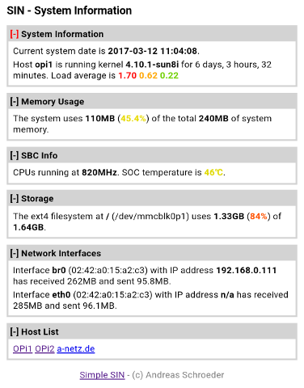

==========
Simple SIN
==========

Simple SIN (System Information) is a small web app written in PHP to
display system information. I created it to show information from a
few Raspberry and Orange PI computers, but it should run fine on any
Linux machine.

   

License
=======

The software is licensed under the GNU General Public License v2.0 or
newer. Please refer to the LICENSE file for details.

Requirements
============

Any web server like apache or nginx and PHP. 

Setup
=====

I assume that the web server is already set up to serve php
files. Then:

* Clone the repository into some directory accessible by the web
  server. E.g. for Ubuntu-style OS clone to ``/var/www/html/sin``::

    git clone https://github.com/motlib/simple-sin sin

* Copy the ``config-sample.php`` to ``config.php`` and adjust the
  settings to your preference.

* Now you can access the web page from the browser as
  ``http://HOSTNAME/sin``.

Development
===========

Adding New Infoboxes
--------------------

It's easy to implement further boxes to show on the web page. There
are two files necessary for each box. Both must have the same name
`SCRIPT.php`.

One of the files goes to the `scripts` directory. It must contain a
function named `sin_get_SCRIPT($sin, &$context)`. In this function you
can do all necessary processing and add the information to the
`$context` array.

The other file goes to the `tmpl` directory and should contain the
html fragement to display in the box, surrounded by a `
` and `
`
tag. All members of the `$context` array are automatic available as
variables here.

Please have a look at the other scripts in the `scripts` and `tmpl`
directories for examples.

